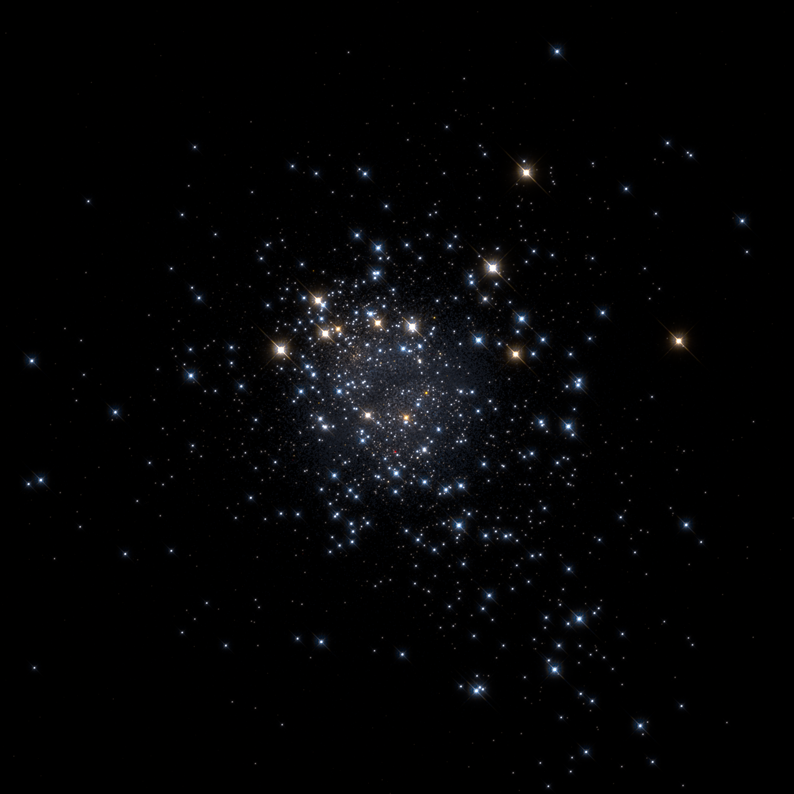

# Fresco
Fresco aims to simulate observations of particle-based simulations, such as
those of a star cluster. It creates an observation-like image from a list of
stars and/or gas particles. Supported filetypes include AMUSE-type hdf5 files,
Starlab files and plaintext files.

For stars, the temperature and radius are calculated using a stellar evolution
code, if these are not already present in the dataset.

Gas particles may also be read. In combination with stars, these will cause
reflection from nearby stars and optionally extinction of light from
background. Without stars, Fresco will make a density plot of the gas.
Optionally, the gas may also be indicated with contour lines.

A random field of background and foreground stars may be added to the image, as
a way to make the image more natural looking and/or to provide a background
that may be obscured by the gas/dust particles.

## Requirements

- Python 2.7 (3.x experimental)
- Numpy
- Scipy
- Matplotlib
- AMUSE (https://github.com/amusecode/amuse)
  - FIMap (optional, for extinction)
  - SSE or SeBa (optional, for calculating stellar luminosities and radii)
- Astropy
- amuse-masc (recommended)

## Usage
    import matplotlib.pyplot as plt
    from amuse.datamodel import Particles
    from amuse.units import units, nbody_system
    from amuse.community.sse.interface import SSE
    from amuse.ext.masc import make_a_star_cluster
    from amuse.ext.fresco import make_fresco_image
    ?make_fresco_image  # See options
    stars = make_a_star_cluster.new_cluster()
    gas = Particles()
    se = SSE()
    se.particles.add_particles(stars)
    from_se = se.particles.new_channel_to(stars)
    from_se.copy()
    image, vmax = make_fresco_image(
        stars, gas,
        mode=["stars"],
        return_vmax=True,
    )
    plt.imshow(image)
    plt.show()

## Authors

Fresco is developed by Inti Pelupessy and Steven Rieder
